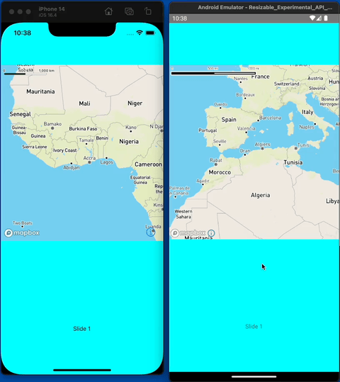

# Description

Example project to demonstrate Mapbox is not usable in a (horizontal) ScrollView on Android

# Running the example:
1. create `.mapbox-access-token.js` with

```ts
export const MAPBOX_ACCESS_TOKEN = "<YOUR_MAPBOX_ACCESS_TOKEN>"
```
2. `yarn && npx pod-install`
3. `yarn android`


